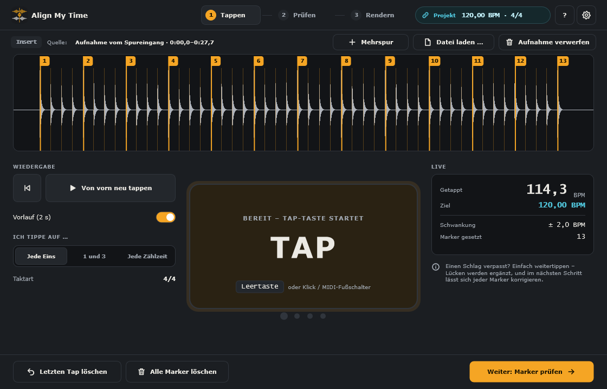
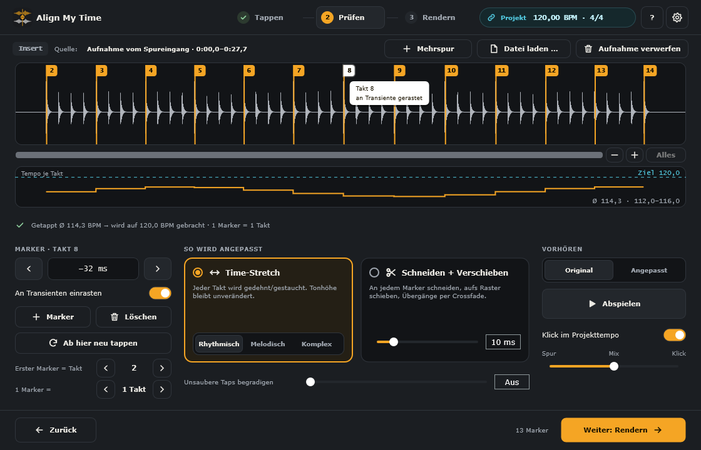
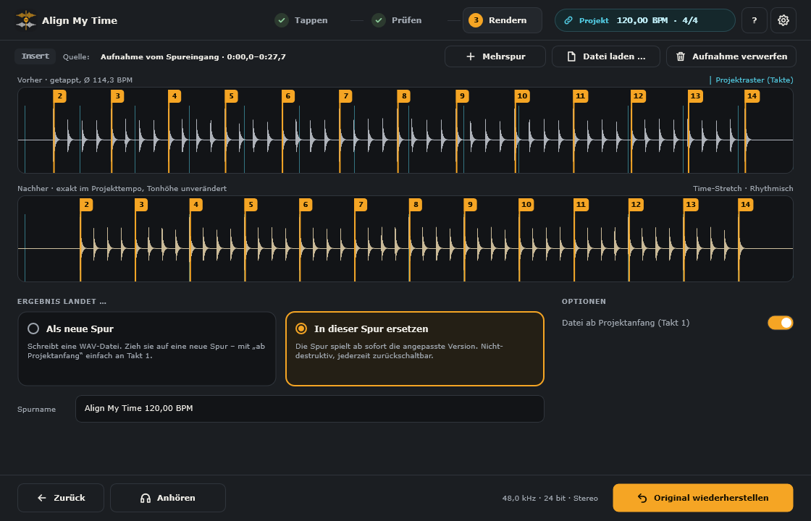

# Align My Time – Handbuch

Dieses Handbuch steckt auch in der App: **Hilfe › Handbuch** (Standalone), das **?** oben rechts oder **F1**.

## Überblick
<!-- id: overview -->

Align My Time bringt eine frei eingespielte Aufnahme aufs Tempo deines Projekts, ohne Warp-Tabellen und ohne Hitpoint-Dialoge. Du hörst die Spur einmal an und tippst im Takt mit. Daraus entstehen Marker, und jeder Marker wird genau auf seinen Takt im Projektraster gezogen.

Die Arbeit läuft in drei Schritten, die oben in der Mitte des Fensters stehen:

1. **Tappen:** Die Spur abspielen und auf jede Eins (oder jede Zählzeit) eine Taste drücken.
2. **Prüfen:** Marker kontrollieren und korrigieren, das Verfahren wählen, vorher und nachher anhören.
3. **Rendern:** Das Ergebnis als WAV-Datei schreiben oder direkt in der Spur ersetzen.

Align My Time gibt es in zwei Formen:

- **Als Plugin** (VST3, AU) in der DAW. Mit ARA 2 (z. B. Cubase, Studio One, Logic, Reaper) liest das Plugin die Events der Spur direkt. Ohne ARA nimmt es die Spur beim Abspielen auf.
- **Als Standalone-App** ohne DAW. Du lädst Audiodateien, gibst das Ziel-Tempo ein und speicherst das Ergebnis als WAV-Datei. Die App hat eine Menüleiste und speichert Projekte (`.amtp`).

## Schnellstart: Standalone-App
<!-- id: quickstart-app -->

1. **Datei › Audiodatei laden …** (`Strg+I`) oder die Datei einfach ins Fenster ziehen. WAV, AIFF, FLAC, Ogg und MP3 gehen.
2. Oben rechts auf die Tempo-Anzeige klicken und **Ziel-Tempo und Taktart** eingeben (auch über **Bearbeiten › Ziel-Tempo und Taktart …**, `Strg+T`).
3. Bei „Ich tippe auf …“ wählen, ob du auf jede Eins, auf 1 und 3 oder auf jede Zählzeit tippst.
4. **Abspielen & tappen** drücken (oder die Tap-Taste, Standard ist `Tab`). Nach 2 Sekunden Vorlauf geht es los: Im Takt die Tap-Taste drücken, bis das Stück zu Ende ist.
5. **Weiter: Marker prüfen**. Marker kontrollieren, Verfahren wählen, mit „Angepasst“ anhören.
6. **Weiter: Rendern** › **Als Datei exportieren …** Die App fragt, wo die WAV-Datei hin soll.
7. **Datei › Projekt speichern** (`Strg+S`), wenn du später weitermachen willst.

Die Audio-Ausgabe stellst du unter **Bearbeiten › Audio- und MIDI-Einstellungen …** ein.

## Schnellstart: Plugin in der DAW
<!-- id: quickstart-plugin -->

### Mit ARA (Cubase, Nuendo, Studio One, Logic, Reaper …)

1. Die Events der Spur auswählen und Align My Time als ARA-Erweiterung öffnen. In Cubase: **Audio › Erweiterungen › Align My Time**. Alle Events der Spur landen im Plugin als *ein* großes Event.
2. Die Taktart und das Tempo kommen aus dem Projekt. Oben rechts steht „Projekt 120,00 BPM · 4/4“.
3. Tappen, prüfen, rendern wie unten beschrieben. Unter „Rendern“ wählst du **Als neue Spur** (WAV-Datei zum Hineinziehen) oder **In dieser Spur ersetzen**.

### Ohne ARA (als Insert-Effekt)

1. Align My Time als Insert auf die Spur legen.
2. Das Projekt abspielen. Das Plugin nimmt die Spur dabei auf, und du kannst im selben Durchgang mittappen. Jedes weitere Abspielen in Schritt 1 ergänzt die Aufnahme. Ein früh gestopptes oder mittendrin gestartetes Abspielen ist kein Problem.
3. Prüfen und rendern wie mit ARA.

Oben links neben „Quelle:“ zeigt ein kleines Schild, woher das Audio kommt: **ARA**, **Insert** oder **Datei**.

Statt der Spur kannst du im Plugin auch eine Audiodatei verwenden: **Datei laden …** oder Datei ins Fenster ziehen. **Zurück zur Spur** wechselt wieder zurück.

## Schritt 1: Tappen
<!-- id: tap -->

Im ersten Schritt hörst du die Aufnahme an und drückst im Takt eine Taste. Jeder Tap wird ein Marker.

### Wie getappt wird

- **Tap-Taste:** Standard ist `Tab`, weil die Leertaste in DAWs meist den Transport steuert. Andere Tasten wählst du unter **Einstellungen › Bedienung**.
- **Maus:** Klick auf das große TAP-Feld.
- **MIDI:** Jede Note und das Sustain-Pedal tappen, z. B. ein Fußschalter. In der Standalone-App aktivierst du dafür den MIDI-Eingang unter **Audio & MIDI**.

### Abspielen

- **Abspielen & tappen** spielt die Spur im Plugin ab, mit 2 Sekunden **Vorlauf**, wenn der Schalter an ist. Das TAP-Feld zählt herunter.
- Im Plugin kannst du stattdessen auch in der DAW abspielen und mittappen.
- In der Standalone-App startet und stoppt die Leertaste die Wiedergabe, wenn sie nicht die Tap-Taste ist.
- **Von vorn neu tappen** startet einen neuen Durchgang. Die alten Marker werden dabei ersetzt. Mit `Strg+Z` holst du sie zurück.

### Worauf tippe ich?

Bei **Ich tippe auf …** wählst du **Jede Eins**, **1 und 3** oder **Jede Zählzeit**. Das lässt sich im nächsten Schritt noch ändern, ohne neu zu tappen. Hast du anders gezählt als eingestellt, schlägt Align My Time das passende Raster selbst vor.

### Fehler beim Tappen

- Ein verpasster Schlag ist kein Problem: einfach weitertippen. Lücken werden automatisch ergänzt (die Marker sind dann als „automatisch ergänzt“ markiert).
- Doppelte Taps werden erkannt und entfernt.
- `Backspace` oder **Letzten Tap löschen** nimmt den letzten Tap zurück, **Alle Marker löschen** fängt neu an.
- Jeder Marker rastet auf den nächsten Anschlag in der Aufnahme ein (bis 70 ms Abstand), wenn „An Transienten einrasten“ an ist.

Rechts unter **Live** siehst du das getappte Tempo, das Ziel-Tempo, die Schwankung und wie viele Marker gesetzt sind.

## Schritt 2: Prüfen
<!-- id: review -->

Hier kontrollierst du die Marker und legst fest, wie angepasst wird.

### Wellenform und Marker

- **Klick** in die Wellenform spielt ab dieser Stelle (Original oder angepasst, je nach Vorhören-Schalter).
- **Strg+Ziehen** verschiebt einen Marker. Unter **Einstellungen › Bedienung** lässt sich das umkehren (dann verschiebt normales Ziehen, und Strg+Klick spielt ab).
- **Doppelklick** setzt einen neuen Marker.
- Ein Klick auf einen Marker wählt ihn aus. `←`/`→` verschieben ihn um 5 ms, mit `Shift` um 1 ms. `↑`/`↓` wählen den vorigen oder nächsten Marker, `Entf` löscht ihn.
- **Mausrad** (oder Pinch auf dem Trackpad) zoomt um die Mausposition, **Shift+Mausrad** scrollt. Dazu gibt es die Scrollleiste und die Buttons −, + und **Alles**.

Unter der Wellenform zeigt die **Tempokurve** das getappte Tempo je Takt und das Ziel-Tempo als gestrichelte Linie. Ausreißer fallen hier sofort auf.

### Marker bearbeiten (linke Spalte)

- Das Feld zwischen den Pfeilen zeigt, wie weit der Marker vom Tap entfernt liegt.
- **An Transienten einrasten:** Marker rasten auf den nächsten Anschlag ein.
- **Marker** fügt mitten im ausgewählten Takt einen Marker ein, **Löschen** entfernt den ausgewählten.
- **Ab hier neu tappen** wiederholt nur den Rest ab dem ausgewählten Marker.
- **Erster Marker = Takt** legt fest, auf welchem Projekttakt der erste Marker landet. Normalerweise wählt Align My Time den nächstgelegenen Takt.
- **1 Marker =** stellt um, wie weit zwei Taps auseinander liegen: 2 Takte, 1 Takt, ½ Takt, 1 Zählzeit oder ½ Zählzeit. Passt das getappte Tempo deutlich besser zu einem anderen Raster, erscheint oben ein Hinweis mit Button, z. B. „Als ½ Takt werten“.

### Unsaubere Taps begradigen

Der Regler (Aus bis 100 %) zieht die Marker zu einem gleichmäßigen Tempoverlauf. Einzelne verrutschte Taps werden korrigiert, echte Tempoänderungen (z. B. ein Ritardando) bleiben erhalten. Mit „An Transienten einrasten“ helfen die erkannten Anschläge mit: Ein korrigierter Marker landet auf dem tatsächlichen Schlag.

Die Einstellung ist nicht-destruktiv. Die getappten Marker bleiben gespeichert, **Aus** (Doppelklick auf den Regler) stellt sie exakt wieder her. Von Hand gesetzte Marker bleiben, wo sie sind.

### So wird angepasst

- **Time-Stretch:** Jeder Takt wird gedehnt oder gestaucht, die Tonhöhe bleibt gleich. Anschläge werden unverändert aus dem Original übernommen, damit Drums und Zupfgeräusche knackig bleiben. Qualität: **Rhythmisch** (Drums, Bass, Begleitung), **Melodisch** (Gesang, Soli) oder **Komplex** (Flächen, ganze Mixe).
- **Schneiden + Verschieben:** An jedem Marker wird geschnitten, jedes Stück aufs Raster geschoben und mit einem kurzen **Crossfade** (2–50 ms) verbunden. Das Audio selbst bleibt unverändert. Ideal für Schlagzeug, besonders bei mehreren Spuren.

### Vorhören

- **Original** oder **Angepasst** wählen und **Abspielen** (oder `Leertaste`). Ist das Ergebnis noch nicht berechnet, rechnet Align My Time es zuerst.
- **Klick im Projekttempo** spielt ein Metronom mit. Der **Mix**-Regler stellt das Verhältnis zwischen Spur und Klick ein (Doppelklick = Mitte).

## Schritt 3: Rendern
<!-- id: render -->

Oben siehst du vorher und nachher auf dem Projektraster. Die Marker des Ergebnisses liegen genau auf den Taktstrichen.

### Plugin

- **Als neue Spur:** Align My Time schreibt eine WAV-Datei (24 bit) in den Ordner `Musik/Align My Time`. Zieh die Kachel rechts auf eine neue Spur. Mit **Datei ab Projektanfang (Takt 1)** beginnt die Datei am Projektanfang, du legst sie also einfach an Takt 1.
- **In dieser Spur ersetzen:** Die Spur spielt ab sofort die angepasste Version. Das ist nicht-destruktiv: **Original wiederherstellen** schaltet zurück. Zum Festschreiben nutzt du die Funktion deiner DAW, in Cubase z. B. „Render in Place“.

### Standalone-App

**Als Datei exportieren …** (oder **Datei › Ergebnis exportieren …**, `Strg+E`) fragt nach dem Speicherort und schreibt eine WAV-Datei (24 bit). Den Dateinamen schlägt das Feld **Spurname** vor.

**Anhören** spielt das Ergebnis ab. Ändert sich nach dem Rendern noch etwas, steht beim Ergebnis „veraltet, bitte neu rendern“.

## Mehrspur
<!-- id: multitrack -->

Mehrere Spuren einer Aufnahme, z. B. alle Mikrofone eines Schlagzeugs, werden mit denselben Markern angepasst und bleiben dadurch phasengleich. Getappt, eingerastet und vorgehört wird auf der Summe aller Spuren.

- **Mit ARA:** Button **Mehrspur** neben „Quelle“ › die anderen Spuren ankreuzen. Dort muss Align My Time ebenfalls als ARA-Erweiterung laufen. „In dieser Spur ersetzen“ ersetzt dann auf allen Spuren.
- **Überall (auch Standalone):** **Mehrspur › Audiodateien hinzufügen …** (Standalone: **Datei › Weitere Spuren hinzufügen …**, `Strg+Shift+I`), oder mehrere Dateien auf einmal ins Fenster ziehen. Die erste Datei wird die Hauptspur.
- **Als neue Spur** bzw. der Export schreibt eine WAV-Datei pro Spur, alle gleich lang und ab derselben Position.

Für Schlagzeug ist **Schneiden + Verschieben** die sicherste Wahl: Dann bleiben die Spuren sample-genau phasengleich.

## Ziel-Tempo und Taktart
<!-- id: tempo -->

Oben rechts steht, worauf angepasst wird, z. B. „Projekt 120,00 BPM · 4/4“ oder „Ziel 96,00 BPM · 3/4“. Ein Klick darauf öffnet die Einstellung:

- **Tempo vom Projekt übernehmen** (nur im Plugin): Tempo, Tempowechsel und Taktarten kommen aus der DAW.
- Sonst gibst du **Tempo** und **Taktart** von Hand ein. Die Standalone-App nutzt immer das eingegebene Tempo.

Das Tempo wird mit dem Projekt gespeichert und lässt sich mit `Strg+Z` rückgängig machen.

## Projekte (Standalone-App)
<!-- id: projects -->

Die Standalone-App speichert deine Arbeit als Projektdatei mit der Endung **.amtp**. Das Menü **Datei** bietet:

| Befehl | Was passiert |
|---|---|
| Neues Projekt (`Strg+N`) | Leeres Projekt. Bei ungespeicherten Änderungen fragt die App vorher. |
| Projekt öffnen … (`Strg+O`) | Öffnet eine `.amtp`-Datei. Auch per Drag & Drop ins Fenster. |
| Zuletzt geöffnet | Die letzten zehn Projekte. |
| Projekt speichern (`Strg+S`) | Speichert unter dem bisherigen Namen (beim ersten Mal wie „Speichern unter“). |
| Projekt speichern unter … (`Strg+Shift+S`) | Speichert unter einem neuen Namen. |

Ein Projekt enthält Verweise auf die Audiodateien, alle Marker (die getappten und die bearbeiteten), Raster, Ziel-Tempo und alle Einstellungen. Das Audio selbst steckt nicht im Projekt.

- Liegen die Audiodateien neben dem Projekt oder in einem Unterordner, findet die App sie auch dann, wenn du den ganzen Ordner verschiebst oder auf einen anderen Rechner kopierst.
- Fehlt eine Datei, sagt die App, welche. Marker und Einstellungen sind trotzdem geladen: Audiodatei neu laden und speichern.
- Ungespeicherte Änderungen zeigt ein `*` im Fenstertitel. Vor „Neu“, „Öffnen“ und „Beenden“ fragt die App nach.
- Beim nächsten Start öffnet die App das zuletzt verwendete Projekt wieder.

Das Dateiformat ist in `docs/PROJEKTFORMAT.md` beschrieben.

## Einstellungen
<!-- id: settings -->

Die Einstellungen öffnest du über das Zahnrad oben rechts, in der Standalone-App auch über **Bearbeiten › Einstellungen …** (`Strg+,`). Sie gelten für alle Projekte und alle Plugin-Instanzen.

- **Allgemein:** Sprache (Deutsch oder English).
- **Bedienung:** Tap-Taste (Leertaste, Tab, T, Eingabe, Strg+Leertaste oder eine eigene Taste) und ob Marker nur mit gedrückter Strg-Taste verschoben werden.
- **Audio & MIDI** (nur Standalone): Audiotreiber, Ausgang, Samplerate, Puffergröße und die MIDI-Eingänge für Fußschalter oder Keyboard. Ein Audioeingang wird nicht gebraucht. Direkt dorthin führt **Bearbeiten › Audio- und MIDI-Einstellungen …**.
- **Credits:** Version, Entwickler und verwendete Bibliotheken. Direkt dorthin führt **Hilfe › Credits**.

**Leertaste in Cubase:** Soll die Leertaste tappen, legst du in Cubase unter *Studio › Tastaturbefehle › Transport* bei „Start/Stop“ statt der Leertaste Strg+Leertaste fest. **Strg+Leertaste** tappt in Align My Time nur, wenn du sie als Tap-Taste wählst.

## Tastenkürzel
<!-- id: shortcuts -->

Auf dem Mac gilt `Cmd` statt `Strg`.

### Überall

| Taste | Funktion |
|---|---|
| Tap-Taste (Standard `Tab`) | Tappen (Schritt 1) |
| `Strg+Z` | Rückgängig (Marker, Raster, Begradigen, Verfahren, Tempo) |
| `Strg+Y` oder `Strg+Shift+Z` | Wiederherstellen |
| `F1` | Handbuch |
| `Esc` | Wiedergabe stoppen, Einstellungen oder Handbuch schließen |

### Schritt 1: Tappen

| Taste | Funktion |
|---|---|
| `Leertaste` | Standalone: Wiedergabe starten/stoppen (wenn sie nicht die Tap-Taste ist) |
| `Backspace` | Letzten Tap löschen |
| `Eingabe` | Weiter zu „Prüfen“ |

### Schritt 2: Prüfen

| Taste | Funktion |
|---|---|
| `Leertaste` | Vorhören starten/stoppen |
| `←` / `→` | Ausgewählten Marker um 5 ms verschieben |
| `Shift+←` / `Shift+→` | Um 1 ms verschieben |
| `↑` / `↓` | Vorigen / nächsten Marker auswählen |
| `Entf` / `Backspace` | Ausgewählten Marker löschen |
| Klick / `Strg`+Ziehen | Ab hier abspielen / Marker verschieben |
| Doppelklick | Marker setzen |
| Mausrad / `Shift`+Mausrad | Zoomen / Scrollen |

### Schritt 3: Rendern

| Taste | Funktion |
|---|---|
| `Leertaste` | Ergebnis anhören / stoppen |

### Standalone-App (Menüleiste)

| Taste | Funktion |
|---|---|
| `Strg+N` / `Strg+O` | Neues Projekt / Projekt öffnen |
| `Strg+S` / `Strg+Shift+S` | Speichern / Speichern unter |
| `Strg+I` / `Strg+Shift+I` | Audiodatei laden / Weitere Spuren hinzufügen |
| `Strg+E` | Ergebnis exportieren |
| `Strg+T` | Ziel-Tempo und Taktart |
| `Strg+,` | Einstellungen |
| `Strg+1` / `Strg+2` / `Strg+3` | Schritt Tappen / Prüfen / Rendern |
| `Strg++` / `Strg+-` / `Strg+0` | Hineinzoomen / Herauszoomen / Alles zeigen |
| `Strg+Q` | Beenden |

## Tipps und Fehlerbehebung
<!-- id: troubleshooting -->

- **Die Leertaste stoppt die DAW statt zu tappen:** Eine andere Tap-Taste wählen (Standard `Tab`) oder in der DAW Start/Stop auf eine andere Taste legen. Unter Windows hört Align My Time die Tap-Taste auch dann, wenn die DAW sie abfängt.
- **„Warte auf die Audiodaten …“ (ARA):** Manche DAWs geben das Audio erst nach einem Moment frei. Align My Time versucht es jede Sekunde erneut. Hilft das nicht: **Spur neu laden**.
- **Insert-Modus: „Beim Abspielen kam am Plugin kein Signal an“:** Ist die Spur stummgeschaltet oder steht das Plugin hinter einem Fader auf null? Das Plugin muss das Signal der Spur bekommen.
- **Das getappte Tempo passt nicht zum Projekt:** In „Prüfen“ das Raster bei **1 Marker =** ändern oder den Vorschlag oben übernehmen.
- **Ein Takt klingt nach dem Anpassen verschmiert:** Den Marker prüfen (oft ein verpasster Anschlag), **An Transienten einrasten** einschalten oder **Schneiden + Verschieben** probieren.
- **Mehrere Spuren klingen phasig:** **Schneiden + Verschieben** verwenden. Alle Spuren müssen von derselben Aufnahme stammen und zur selben Zeit beginnen.
- **Exportierte Dateien finden:** Im Plugin unter `Musik/Align My Time` (Button **Im Ordner zeigen**). In der Standalone-App dort, wo du sie gespeichert hast.
- **Aufnahmen im Insert-Modus** liegen unter `%APPDATA%\Align My Time\Captures` (Windows) bzw. `~/Library/Application Support/Align My Time/Captures` (macOS). Sie gehören zu DAW-Projekten und können gelöscht werden, wenn das Projekt nicht mehr gebraucht wird.
